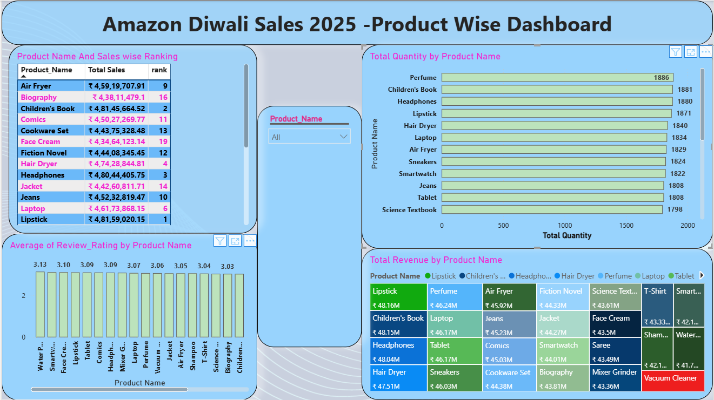
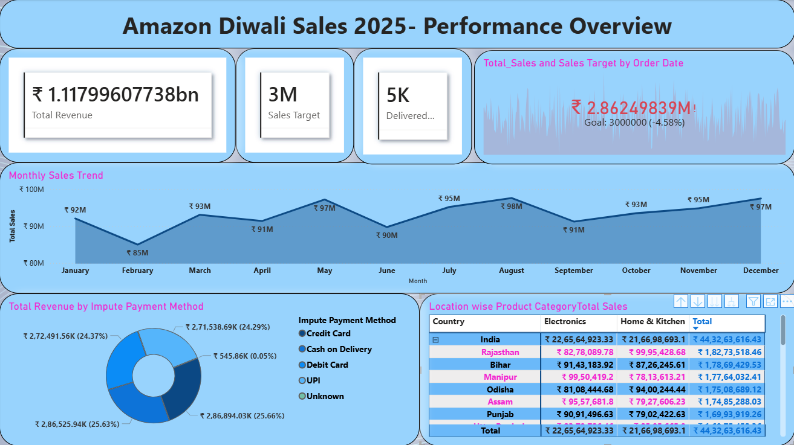

📊 Amazon Diwali Sales 2025 - India | Power BI Project

📝 Project Overview

This project analyzes Amazon Diwali Sales 2025 data in India to understand sales performance, customer behavior, and product trends during the festive season.
Raw data was cleaned and prepared using Microsoft Excel, and interactive dashboards were created using Power BI for visualization.

---

🛠️ Tools & Technologies

- Power BI
- Microsoft Excel (Data Cleaning)
- DAX
- Power Query

Domain: E-Commerce

---

🎯 Objectives

- Analyze overall sales performance
- Identify top-selling products and categories
- Understand customer purchase behavior
- Compare sales across regions

---

📂 Data Source

Amazon Diwali Sales 2025 dataset (India)

---

❓ Problem Statement

Analyze sales data to identify trends, top products, and customer behavior during the Diwali season.

---

📑 Attribute Details

- Order ID – Unique order identifier
- Product Name – Name of product
- Category – Product category
- Quantity – Units sold
- Sales – Revenue generated
- Location – Customer region
- Order Date – Purchase date

---

🔄 Data Processing

- Data cleaning performed using Microsoft Excel
- Removed missing values and duplicates
- Data transformation using Power Query
- Created measures using DAX

---

📈 Analysis & Insights

🏆 Product Ranking(Table):

Products were ranked based on total sales. Lipstick secured the top position, followed by Children's Books and Headphones.

🌍 Location-wise Sales(Matrix):

Rajasthan recorded the highest sales in Electronics and Home & Kitchen categories, indicating strong regional demand.

📉 Sales Trend(Line chart); 

August recorded the highest sales (~97.6M), while February had the lowest (~85.0M), showing fluctuations across months.

📊 Key Metrics(Cards);

- Total Delivery Orders: ~5K
- Revenue: In billions
- Sales Target

💳 Revenue by Payment Method(Donut Chart):

Credit Card contributed the highest share (~25.66%) of total revenue.

⭐ Product Ratings(Stacked Column Chart):

Water Purifier had the highest average rating (3.13), while Hair Dryer had the lowest (2.87).

🎯 KPI Analysis

Sales target: 3M
Actual performance: -4.58% below target

📦 Quantity Analysis(Stacked Bar Chart):

Perfume had the highest quantity sold (~1,886 units), while Vacuum Cleaner had the lowest (~1,674 units).

🧩 Revenue Distribution(Tree Map):

Lipstick generated the highest revenue (~48.16M), while Vacuum Cleaner contributed lower revenue (~41.19M).

---
## 📸 Dashboard Screenshots

### Dashboard 1

### Dashboard 2

📊 Dashboard Summary

Two interactive dashboards were created in Power BI:

- Amazon Diwali Sales 2025 - Product-wise Dashboard (with product name slicer)
- Amazon Diwali Sales 2025 - Performance Overview Dashboard

These dashboards help in analyzing product-level performance and overall sales insights effectively.

---
## 📄 Project Report

[Download PDF](powerbi-report.pdf)
🚀 Conclusion

This project demonstrates how raw data can be cleaned using Excel and transformed into meaningful insights using Power BI.
The combination of product-wise and performance overview dashboards provides a clear understanding of sales trends, customer behavior, and business performance during the festive season.
